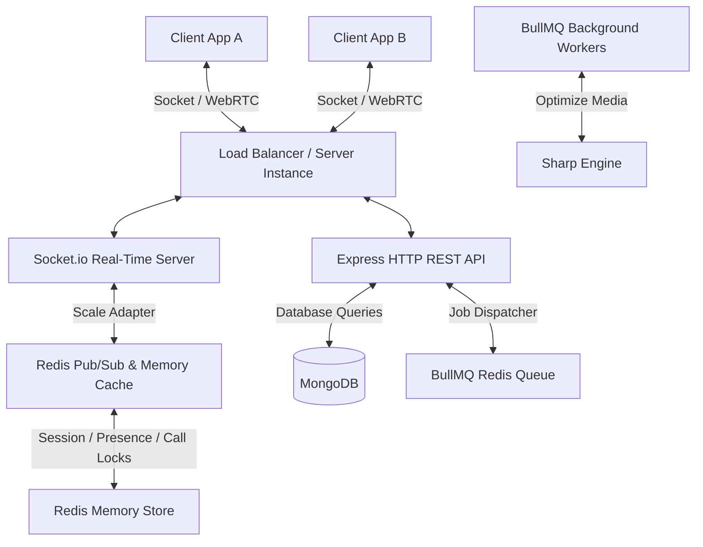

# 🚀 Enterprise-Grade Real-Time Chat & WebRTC Calling Backend

A high-performance, robust, and horizontally scalable backend service designed for real-time messaging, group conversations, status stories, and WebRTC audio/video signaling. 

Built with **Node.js**, **Express**, **Socket.io**, and **MongoDB**, backed by **Redis** for distributed state management and **BullMQ** for asynchronous background media optimization.

---

## ⚡ Key Features

- **📞 WebRTC Voice & Video Calling**: Real-time signaling relay with active call locks, busy indicators, receiver offline detection, and fallback systems.
- **💬 Real-Time Messaging & Chat Rooms**: 1-to-1 and Group chats with typing indicators, soft delete (self/everyone), forward, reply, and star actions.
- **👥 Group Management**: Dynamic member management (add/remove users) and pinned messages.
- **🟢 Presence Tracking**: Online/offline state synchronization with multi-device connections handling and contact status updates.
- **⏳ Expiring Status/Stories**: 24-hour expiring image/video stories with viewer counters and updates grouping.
- **🛠 BullMQ Media Workers**: Asynchronous, non-blocking background image optimization using Sharp (converting avatar, status, and message attachments to optimized WebP).
- **🔒 Secure Device Session Control**: Multi-device login tracking with HTTP-Only Cookie refresh token rotation and session revocation (revoke specific or all other devices).
- **🎯 Push & In-App Alerts**: Redis pub/sub backed notification queue to push alerts in real-time or fall back to offline workers.
- **🛡 Trust & Safety**: Complete user blocking, reporting, and message search capabilities.

---

## 🏗 System Architecture

The project utilizes a distributed memory model to support horizontal clustering and high traffic volumes:



---

## 🛠 Tech Stack

- **Runtime**: Node.js (ES Modules)
- **Framework**: Express.js
- **Database**: MongoDB (Mongoose ODM)
- **In-Memory Store & Adapter**: Redis & `@socket.io/redis-adapter`
- **Real-Time Communication**: Socket.io
- **Media Processing**: Sharp & Multer
- **Task Queue**: BullMQ
- **Authentication**: JSON Web Tokens (JWT) with HTTP-only cookies

---

## 📂 Project Structure

```text
src/
├── config/             # DB, Redis connection, and queue configs
├── jobs/               # BullMQ background workers (media optimization, push notifications)
├── middlewares/        # Authentication, rate limiters, validation, and error handlers
├── modules/            # Domain-driven features (Auth, Chat, Message, Call, Story, Notification)
│   ├── controller.js   # Handles incoming requests & response mapping
│   ├── model.js        # Mongoose database schema definitions
│   ├── routes.js       # HTTP routing specifications
│   └── services.js     # Business & database transaction logic
├── sockets/            # Socket.io connection, presence, and WebRTC event controllers
├── utils/              # Token generation, helpers, and Redis caches
├── app.js              # Express app definitions
└── server.js           # Server startup and socket server wrappers
```

---

## 🚀 Quick Start Guide

### Prerequisites
Make sure you have the following installed locally:
- Node.js (v18+)
- MongoDB
- Redis Server

### 1. Installation
Clone the repository and install dependencies:
```bash
git clone https://github.com/your-username/chat-backend.git
cd chat-backend
npm install
```

### 2. Environment Setup
Create a `.env` file in the root directory:
```env
PORT=5000
MONGO_URI=mongodb://localhost:27017/chat-app
REDIS_URL=redis://localhost:6379
ACCESS_TOKEN_SECRET=your_access_token_secret
REFRESH_TOKEN_SECRET=your_refresh_token_secret
```

### 3. Run the Servers
Start the database background processes (Redis/MongoDB) on your system, and then run the application:

```bash
# Start the backend server (automatically runs nodemon in dev)
npm run dev
```

---

## 🔌 WebRTC Calling Workflow

When a user initiates a call, the server coordinates the signaling steps and locks their availability state in Redis to prevent multiple call collisions:

```text
Caller (Client A)                 Server (Socket.io & Redis)               Receiver (Client B)
       │                                     │                                    │
       ├─────────── callUser ───────────────>┤                                    │
       │                                     ├───────── incomingCall ────────────>┤
       │                                     │                                    │
       │<───────── callAccepted ─────────────┼─────────── acceptCall ─────────────┤
       │                                     │                                    │
       ├────────── iceCandidate ────────────>┤                                    │
       │                                     ├────────── iceCandidate ───────────>┤
       │                                     │                                    │
       ├───────────── endCall ──────────────>┤                                    │
       │                                     ├─────────── callEnded ─────────────>┤
```

---

## 🧪 Integration & Manual Testing

The project includes pre-configured testing setups:
1. **REST & Socket API Integration Tests**: Run `node src/tests/test_api.js` to execute a 33-step complete automation test flow verifying endpoints, databases, socket updates, and cache state.
2. **WebRTC In-Browser Test Client**: An in-browser WebRTC testing utility is included. Serve it locally with:
   ```bash
   npx serve .
   ```
   Open `http://localhost:3000/call_test.html` in your browser (using local servers to bypass browser microphone/camera security restrictions).

---

## 📄 Documentation Links

- For HTTP endpoints payloads and query params, check [postman_api_docs.md](file:///home/amansagar/Projects/chat-backend/postman_api_docs.md).
- For WebSocket and real-time events schema, check [websocket_docs.md](file:///home/amansagar/Projects/chat-backend/websocket_docs.md).
- For Redis caching and invalidation specs, check [redis_docs.md](file:///home/amansagar/Projects/chat-backend/redis_docs.md).
- For React frontend integration prompt, check [frontend_prompt.md](file:///home/amansagar/Projects/chat-backend/frontend_prompt.md).

---

## 🤝 Contributing
Contributions, issues, and feature requests are welcome! Feel free to check the issues page.
