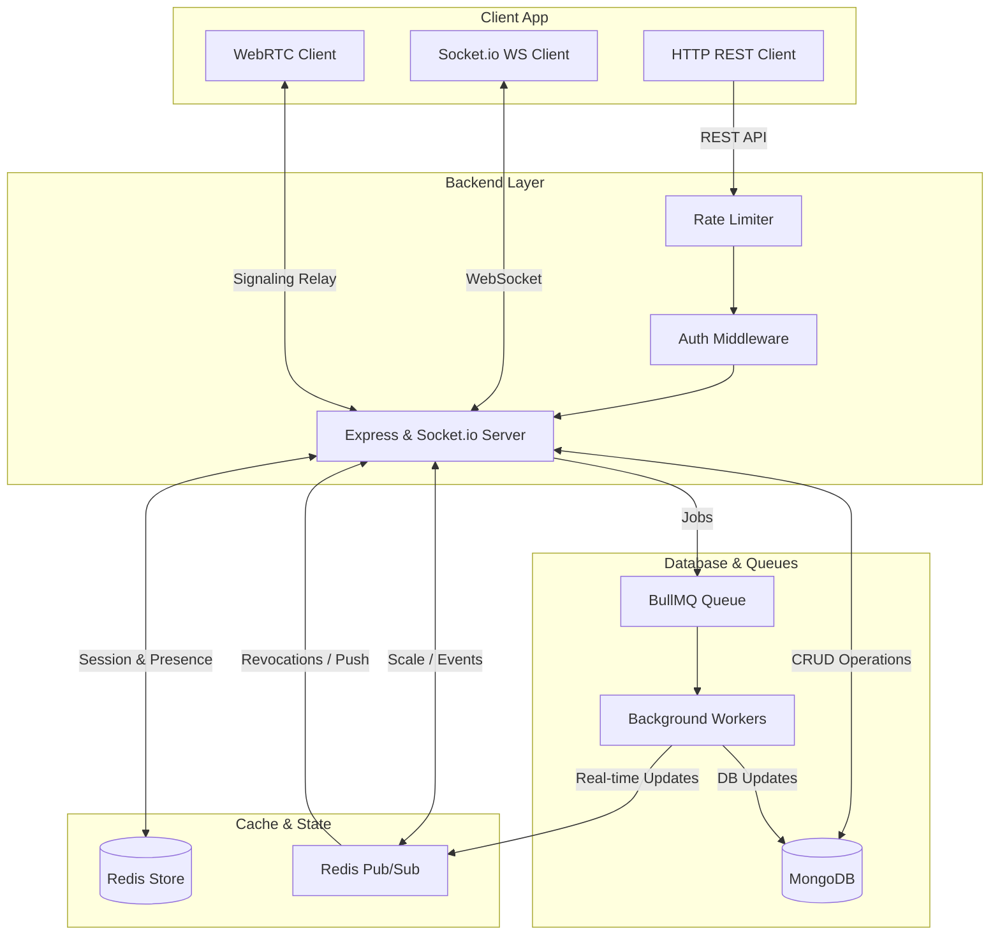

# 🚀 Enterprise-Grade Real-Time Chat & WebRTC Calling Backend

A high-performance, robust, and horizontally scalable backend service designed for real-time messaging, group conversations, status stories, and WebRTC audio/video signaling. 

Built with **Node.js**, **Express**, **Socket.io**, and **MongoDB**, backed by **Redis** for distributed state management and **BullMQ** for asynchronous background media optimization.

---

## 🏗 System Architecture

The following diagram illustrates the high-level architecture of the real-time calling and messaging system:



---

## ⚡ Key Features

- **📞 WebRTC Voice & Video Calling**: Real-time signaling relay with active call locks, busy indicators, receiver offline detection, and fallback systems.
- **💬 Real-Time Messaging & Chat Rooms**: 1-to-1 and Group chats with typing indicators, soft delete (self/everyone), forward, reply, and star actions.
- **👥 Group Management**: Dynamic member management (add/remove users) and pinned messages.
- **🟢 Presence Tracking**: Online/offline state synchronization with multi-device connections handling and contact status updates.
- **⏳ Expiring Status/Stories**: 24-hour expiring image/video stories with viewer counters and updates grouping.
- **🛠 BullMQ Media Workers**: Asynchronous, non-blocking background image optimization using Sharp (converting avatar, status, and message attachments to optimized WebP).
- **🔒 Secure Device Session Control**: Multi-device login tracking with HTTP-Only Cookie refresh token rotation and session revocation (revoke specific or all other devices).
- **🎯 Push & In-App Alerts**: Redis pub/sub backed notification queue to push alerts in real-time or fall back to offline workers.
- **🛡 Trust & Safety**: Complete user blocking, reporting, and message search capabilities.

---


## 🛠 Tech Stack

- **Runtime**: Node.js (ES Modules)
- **Framework**: Express.js
- **Database**: MongoDB (Mongoose ODM)
- **In-Memory Store & Adapter**: Redis & `@socket.io/redis-adapter`
- **Real-Time Communication**: Socket.io
- **Media Processing**: Sharp & Multer
- **Task Queue**: BullMQ
- **Authentication**: JSON Web Tokens (JWT) with HTTP-only cookies

---

## 📂 Project Structure

```text
src/
├── config/             # DB, Redis connection, and queue configs
├── jobs/               # BullMQ background workers (media optimization, push notifications)
├── middlewares/        # Authentication, rate limiters, validation, and error handlers
├── modules/            # Domain-driven features (Auth, Chat, Message, Call, Story, Notification)
│   ├── controller.js   # Handles incoming requests & response mapping
│   ├── model.js        # Mongoose database schema definitions
│   ├── routes.js       # HTTP routing specifications
│   └── services.js     # Business & database transaction logic
├── sockets/            # Socket.io connection, presence, and WebRTC event controllers
├── utils/              # Token generation, helpers, and Redis caches
├── app.js              # Express app definitions
└── server.js           # Server startup and socket server wrappers
```

---

## 🚀 Quick Start Guide

### Prerequisites
Make sure you have the following installed locally:
- **Node.js** (v18+)
- **Docker & Docker Compose** (for spinning up databases) OR local installations of **MongoDB** and **Redis**.

---

## 📊 Load Testing & Benchmarks

The backend is benchmarked using **Artillery** for both HTTP REST APIs and Socket.io WebSocket connections.

### How to Run Load Tests

1. Ensure the databases (MongoDB & Redis) are running:
   ```bash
   docker-compose up -d
   ```
2. Start the backend server locally with rate limits disabled:
   ```bash
   DISABLE_RATE_LIMIT=true npm run dev
   ```
3. Run the complete test suite (Seed, HTTP Test, Socket Test, Cleanup):
   ```bash
   npm run load-test:all
   ```

Or run individual phases:
- **Seed Database**: `npm run load-test:seed`
- **HTTP REST Load Check**: `npm run load-test:http`
- **Socket.io Load Check**: `npm run load-test:socket`
- **Cleanup Test Records**: `npm run load-test:cleanup`

### Benchmarking Metrics

#### 1. HTTP API Performance (Sustained Load)
- **Total Requests**: 2,640 (GET Profile, GET Search, GET Chats, POST Message)
- **Error Rate**: 0% (All requests succeeded)
- **Throughput**: 32 requests/second
- **Response Times**:
  - **Median (p50)**: 12.1 ms
  - **95th Percentile (p95)**: 34.1 ms
  - **99th Percentile (p99)**: 74.4 ms

#### 2. Socket.io WebSocket Performance
- **Total Emitted Events**: 1,800 (Join, Join Chat, Typing indicators, Send Message)
- **Error Rate**: 0% (All events delivered)
- **Throughput**: 21 emits/second
- **Response Times (Acknowledgement & Relay)**:
  - **Median (p50)**: 0.3 ms
  - **95th Percentile (p95)**: 0.7 ms
  - **99th Percentile (p99)**: 1.5 ms

