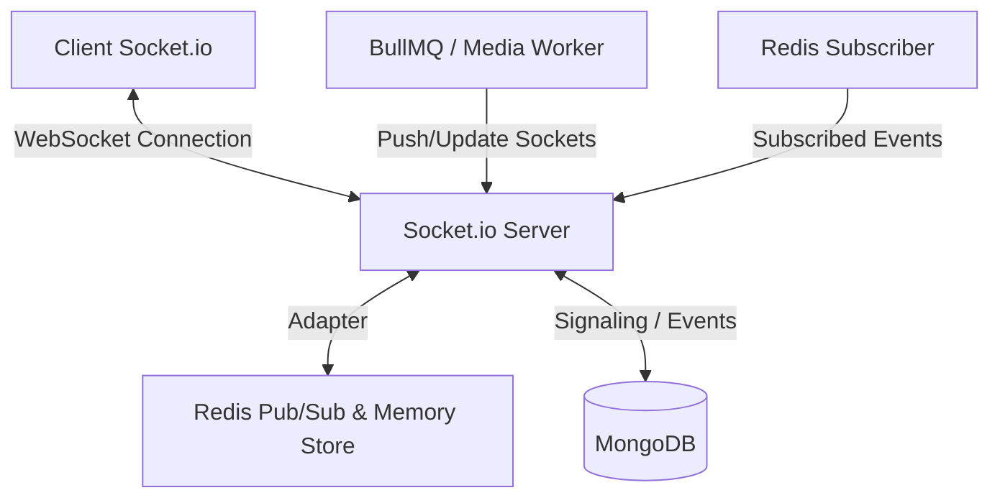

# WebSocket Implementation Documentation

This document provides a comprehensive detail of the WebSocket implementation in the backend project. The real-time messaging, WebRTC signaling (calling), typing indicators, online/offline presence tracking, and session management are powered by **Socket.io** backed by **Redis** for distributed state management and horizontal scaling.

---

## 1. High-Level Architecture

The real-time layer is integrated into the HTTP server and scaled using Redis.



### Components:
*   **Socket.io Server (`src/server.js`)**: Wraps the Express HTTP server and allows cross-origin requests.
*   **Redis Adapter (`@socket.io/redis-adapter`)**: Publishes socket packets across multiple server instances (clustering).
*   **State Tracker (Redis)**: Tracks user online/offline status, multi-device socket mappings, and active calls (busy status).
*   **Redis Pub/Sub (`src/services/notification.subscriber.js`)**: Listens to server-wide events (like notifications or session revocations) and pushes them to active sockets.

---

## 2. Server Setup & Initialization

### File: [server.js](file:///home/amansagar/Projects/chat-backend/src/server.js)
1.  Creates an HTTP server wrapping the Express `app`.
2.  Initializes Socket.io `Server` with CORS configuration: `origin: "*"`.
3.  Hooks up the **Redis Adapter** using publishing and subscribing Redis clients (`pub` and `sub` from [redisPubSub.js](file:///home/amansagar/Projects/chat-backend/src/config/redisPubSub.js)).
4.  Calls `initSocket(io)` to register event handlers.

---

## 3. Connection & Authentication Lifecycle

### File: [socket.js](file:///home/amansagar/Projects/chat-backend/src/sockets/socket.js)

#### 1. Connecting (`"connection"`)
When a client connects, the socket ID is logged. However, the socket is not fully authenticated until the client triggers the `join` event.

#### 2. Joining & Authenticating (`"join"`)
*   **Payload**: `{ userId, token }`
*   **Authentication**: If a JWT `token` is provided, it is verified using `process.env.ACCESS_TOKEN_SECRET`. Upon success, `sessionId` is extracted and saved to the socket instance.
*   **Session-to-Socket Mapping (Redis)**:
    *   Adds Socket ID to Redis Set: `SessionSockets:${sessionId}` (for bulk session revocation).
    *   Maps Socket ID to Session ID: `SocketSession:${socket.id}`.
*   **Room Joining**: The socket joins a room uniquely identified by its user ID: `socket.join(userId)`. This room allows target routing of alerts, notifications, and calls.

#### 3. Online/Offline Presence Tracking
*   **Multi-Device Handling**: Multiple tabs/devices can connect with the same `userId`. We keep track of active sockets in a Redis set: `OnlineSockets:${userId}`.
*   **Going Online**:
    *   If `OnlineSockets:${userId}` cardinality was `0`, it means the user was offline and is now coming online.
    *   Updates MongoDB: `isOnline: true` for the User.
    *   Fetches all active chats of the user.
    *   **Blocked Filters**: Collects participants from active chats, filters out any user who has blocked the current user or is blocked by the current user.
    *   Emits `UserPresence` event `{ userId, isOnline: true }` to the rooms of all allowed participants.
*   **Going Offline (Disconnect)**:
    *   Removes Socket ID from `OnlineSockets:${userId}` and `SessionSockets:${sessionId}`.
    *   Checks if the user has any other active sockets. If cardinality drops to `0`:
        *   Updates MongoDB: `isOnline: false` and `lastSeen: new Date()`.
        *   Broadcasts `UserPresence` event `{ userId, isOnline: false, lastSeen }` to all active chat participants (filtering out blocked relations).

---

## 4. Messaging & Interaction Events

Users can join specific chat rooms to receive messages instantly.

```
Client 1 ──(joinChat: chatId)──> [Socket.io Room: chatId] <──(joinChat: chatId)── Client 2
Client 1 ──(sendMessage)───────> [Server Relays] ───────────(ReceiveMessage)────> Client 2
```

### Event Handlers:
| Client Event | Description | Action | Server Broadcast Event |
| :--- | :--- | :--- | :--- |
| `joinChat` | Joins a chat room. | `socket.join(chatId)` | — |
| `leaveChat`| Leaves a chat room. | `socket.leave(chatId)` | — |
| `sendMessage`| Sends a chat message. | Relays message to the room. | `ReceiveMessage` (to other users in room) |
| `typing` | User starts typing. | Broadcasts typing event and sets a 3s auto-stop fallback. | `Typing` |
| `stopTyping` | User stops typing. | Clears any fallback timeouts and broadcasts stop. | `StopTyping` |
| `editMessage`| Updates an edited message. | Relays updated message to room. | `MessageEdited` |
| `deleteMessage`| Deletes a message. | Relays deleted message ID to room. | `MessageDeleted` |
| `markSeen` | Marks a message as read. | Relays message seen payload to room. | `MessageSeen` |

---

## 5. WebRTC Calling & Signaling Relays

Real-time audio/video calls are supported by WebRTC. The Socket.io server acts as the signaling channel.

```
Caller (Client A)              Server (Socket.io & Redis)             Receiver (Client B)
       │                                   │                                  │
       ├────────── callUser ──────────────>┤                                  │
       │                                   ├──────── incomingCall ───────────>┤
       │                                   │                                  │
       │<──────── callAccepted ────────────┼────────── acceptCall ────────────┤
       │                                   │                                  │
       ├───────── iceCandidate ───────────>┤                                  │
       │                                   ├───────── iceCandidate ──────────>┤
       │                                   │                                  │
       ├─────────── endCall ──────────────>┤                                  │
       │                                   ├────────── callEnded ────────────>┤
```

### Flow and Logic:
1.  **Placing a Call (`"callUser"`)**:
    *   Verifies if receiver is already busy by querying Redis (`activeCall:${targetUserId}`). If busy, emits `callBusy` back to caller.
    *   Verifies block status (checks if caller/receiver block each other in DB). If blocked, emits `callError`.
    *   Creates a new `Call` document in MongoDB with status `ongoing`.
    *   Locks active call status in Redis: sets `activeCall:${callerId}` and `activeCall:${receiverId}` to the `callId`.
    *   **Online Check**:
        *   **If Receiver is Online**: Emits `incomingCall` with signaling and call data.
        *   **If Receiver is Offline**: Invokes BullMQ `notificationQueue` to send a push notification. Updates call status to `missed`, deletes call lock from Redis, and emits `callUserOffline` to the caller.
2.  **Accepting a Call (`"acceptCall"`)**:
    *   Relays `callAccepted` event along with signaling data back to the caller.
3.  **Rejecting a Call (`"rejectCall"`)**:
    *   Updates `Call` status to `rejected` in MongoDB.
    *   Clears Redis busy locks (`activeCall:${userId}`).
    *   Relays `callRejected` to the caller.
4.  **ICE Candidates Relay (`"iceCandidate"`)**:
    *   Directly relays WebRTC connection candidates (`iceCandidate` event) between caller and receiver.
5.  **Ending a Call (`"endCall"`)**:
    *   Updates `Call` status to `completed` in MongoDB and records final duration.
    *   Clears Redis busy locks for both parties.
    *   Relays `callEnded` to the other participant.
6.  **Disconnection Cleanup**:
    *   If a socket disconnects while active call is registered in Redis (`activeCall:${socket.userId}`):
        *   Updates `Call` status to `completed` and calculates call duration.
        *   Relays `callEnded` with reason `peer_disconnected` to the other peer.
        *   Deletes both Redis active call keys.

---

## 6. External Triggers & Background Processors

Some WebSocket events are triggered by database workers or Redis subscribers outside of immediate client interactions.

### 1. Redis Pub/Sub Subscriber (`src/services/notification.subscriber.js`)
Subscribes to channels for system-wide inter-process communications:
*   **`NOTIFICATION` Channel**:
    *   Triggered when notifications are saved.
    *   Relays `ReceiveNotification` to the target user's private room.
*   **`SESSION_REVOCATION` Channel**:
    *   Triggered when a user logs out, passwords are changed, or sessions are invalidated.
    *   Retrieves all socket IDs associated with the revoked session using the Redis set `SessionSockets:${sessionId}`.
    *   Emits `SessionRevoked` event and disconnects those sockets.

### 2. BullMQ Media Processing Worker (`src/jobs/media.worker.js`)
Optimizes media files (avatars, messages, status files) asynchronously.
*   **Avatar Processed**: Emits `AvatarProcessed` event to the user's private room with the updated URL.
*   **Message Media Processed**: Emits `MessageMediaProcessed` event to the specific `chatId` room, updating the message with the optimized WebP URL.
*   **Status Media Processed**: Emits `StatusMediaProcessed` event to the user.

### 3. BullMQ Notification Worker (`src/jobs/notification.worker.js`)
Processes system-wide background notifications.
*   Checks user online status by checking the cardinality of `OnlineSockets:${notification.userId}` in Redis.
*   If the user is online, skips sending heavy email or push notifications, as the user will receive the alert in real-time via Socket.io.


---

## 7. Socket.io Event Summary (Cheat Sheet)

### Client to Server Events
*   `join` (payload: `{ userId, token }`) - Authenticate & register online.
*   `joinChat` (payload: `chatId`) - Enter a chat room.
*   `leaveChat` (payload: `chatId`) - Leave a chat room.
*   `sendMessage` (payload: message object) - Relay chat message.
*   `typing` (payload: `{ chatId }`) - Trigger typing status.
*   `stopTyping` (payload: `{ chatId }`) - Cancel typing status.
*   `editMessage` (payload: message object) - Relay edited message.
*   `deleteMessage` (payload: message object) - Relay deleted message info.
*   `markSeen` (payload: `{ chatId, messageId, userId }`) - Relay message read status.
*   `callUser` (payload: `{ targetUserId, signalData, type }`) - Initiate WebRTC call.
*   `acceptCall` (payload: `{ callerId, signalData, callId }`) - Accept call.
*   `rejectCall` (payload: `{ callerId, callId }`) - Reject call.
*   `iceCandidate` (payload: `{ targetUserId, candidate, callId }`) - Send connection route.
*   `endCall` (payload: `{ targetUserId, callId, duration }`) - Hang up call.

### Server to Client Events
*   `UserPresence` (payload: `{ userId, isOnline, lastSeen }`) - Broadcast user status.
*   `ReceiveMessage` (payload: message object) - Deliver message.
*   `Typing` (payload: `{ userId }`) - Show typing state.
*   `StopTyping` (payload: `{ userId }`) - Clear typing state.
*   `MessageEdited` (payload: updated message) - Show edited message.
*   `MessageDeleted` (payload: deleted message meta) - Remove message from view.
*   `MessageSeen` (payload: `{ messageId, userId }`) - Show read tick.
*   `callBusy` (payload: `{ targetUserId }`) - Callee is busy.
*   `callError` (payload: `{ message }`) - Calling error (e.g. blocked).
*   `incomingCall` (payload: `{ from, signalData, type, callId }`) - Notify callee.
*   `callUserOffline` (payload: `{ targetUserId, callId }`) - Callee is offline.
*   `callAccepted` (payload: `{ signalData, callId }`) - Notify caller of acceptance.
*   `callRejected` (payload: `{ callId }`) - Notify caller of rejection.
*   `iceCandidate` (payload: `{ candidate, from, callId }`) - Receive connection route.
*   `callEnded` (payload: `{ callId, reason }`) - Notify call ended.
*   `ReceiveNotification` (payload: notification object) - Real-time push alert.
*   `SessionRevoked` (payload: `{ message }`) - Active session invalidated.
*   `AvatarProcessed` (payload: `{ avatarUrl }`) - Profile picture optimized.
*   `MessageMediaProcessed` (payload: `{ messageId, mediaUrl }`) - Chat image optimized.
*   `StatusMediaProcessed` (payload: `{ statusId, mediaUrl }`) - Status image optimized.
